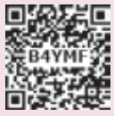

---
title: 'Magnetism and magnetic effects of electric current'
weight: 3
extensions:

- katex
---   

 **U N I T 3 MAGNETISM AND MAGNETIC EFFECTS OF ELECTRIC CURRENT**

> “The magnetic force is animate, the human soul while it imitates a soul in many respects it surpasses s united to an organic body” – William Gilbert

 **LEARNING OBJECTIVES** 

**In this unit, the student is exposed to** 

• Earth’s magnetic field and magnetic elements

• Basic properties of magnets

• Statement of Coulomb inverse square law of m

• Magnetic dipole

• Magnetic field due to a dipole along axial line a

• Torque acting on a bar magnet in a uniform m

• Potential energy of a bar magnet placed in a un

• Magnetic properties – permeability, susceptibi

• Classification of magnetic materials – dia, para

• Concept of Hysteresis

• Magnetic effects of electric current – long strai

• Right hand thumb rule and Maxwell’s right han

• Biot-Savart’s law – applications

• Tangent law and Tangent Galvanometer

• Current loop as a magnetic dipole

• Magnetic dipole moment of revolving electron

• Ampère’s circuital law – applications

• Solenoid and toroid

• Lorentz force – charged particle moving in an

• Cyclotron

• Force on a current carrying conductor in a ma

• Force between two long parallel current carryi

• Torque on a current loop in a magnetic field

• Moving Coil Galvanometer

  
